# DRAFT

# Disclaimer

The purpose of this tutorial is to help do the minimum configuration to get a Keycloak server ready to work with the DotStat suite of products. It is not a guide on how to set it up securely, and taking any security advice from it would be exceptionally unwise. Use official documentation or advice from your organization's IT security team.

# Introduction

The purpose of this tutorial is to describe how to set up a Keycloak server to work with the DotStat .NET and JavaScript services. Obviously this means that in order to test this is all working, you'll need to have at least some of those services installed. Doing so is beyond the scope of this tutorial, but is described in the SIS-CC documentation pages both [from source](https://sis-cc.gitlab.io/dotstatsuite-documentation/install-source-code/) and [from containers](https://sis-cc.gitlab.io/dotstatsuite-documentation/install-docker/). I'm working with a single instance of the NSI web services, the [Data Lifecycle Manager](https://gitlab.com/sis-cc/.stat-suite/dotstatsuite-data-lifecycle-manager), the [JavaScript config service](https://gitlab.com/sis-cc/.stat-suite/dotstatsuite-config) and the built-in proxy that comes with the Data Lifecycle Manager.

## Installing Keycloak

The actual installation of the Keycloak server is beyond the scope of this tutorial, but I will give you a few pointers. First up, there are some instructions [on the SIS-CC documentation pages](https://sis-cc.gitlab.io/dotstatsuite-documentation/install-source-code/monotenant-install-js-as-windows-services/#keycloak) describing how to install it as a Windows service. Also, the [official Keycloak documentation](https://www.keycloak.org/docs/7.0/server_installation/#_standalone-mode) is great, if a little intimidating (due to the sheer number of options). For reference, I'm running it locally in standalone-mode, which is almost certainly what you need to do to.

Finally, and this is important, so I'm going to say it twice: use Keycloak version 7.0.0! The DotStat JavaScript services are written to work with this version, not the latest.

```
Use Keycloak version 7.0.0!
```

## Configuring Keycloak

When you first open up the Keycloak administrative console (mine was located at http://127.0.0.1:8080/auth/admin because I'm running it locally, but yours may vary), you'll be confronted with a page very similar to this:


This is the "master" realm. The "one realm to rule them all". A "realm" in Keycloak manages a set of users, credentials, roles and groups. This means that a user in one realm can't log into another, and is very useful for separating groups of applications. For instance, you could use one single Keycloak server for all your environments (DEV, QA and PROD etc) by having a different realm for each one.

### Creating a Realm

Now, it's [not recommended](https://www.keycloak.org/docs/latest/server_admin/#the-master-realm) to use the master realm to manage access to applications, so we're going to have to create a new realm. Luckily, that's dead easy. Simply mouse-over the "Master" dropdown in the top left-hand of the page, and select the "Add realm" button.

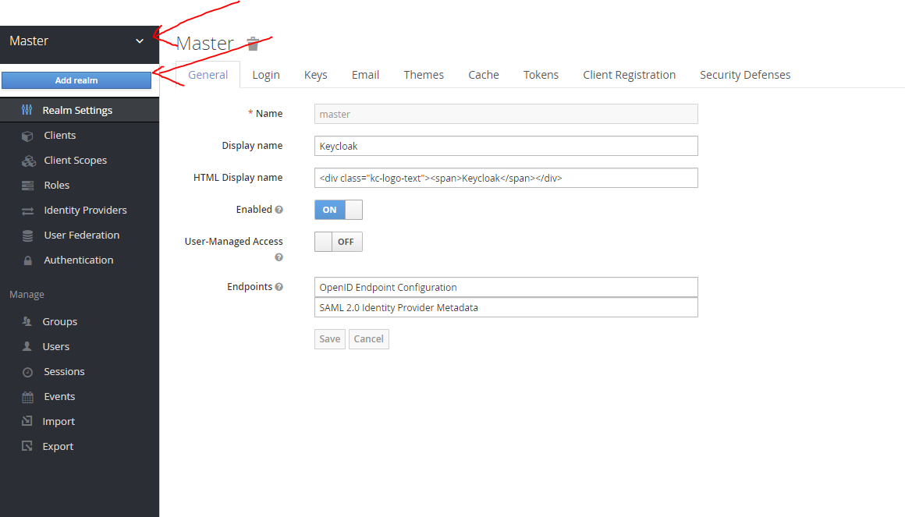

This will take you to the following screen, where you can either import some JSON defining your realm, or simply give it a name and create it. For our purposes you can name it whatever you want, but it should be meaningful. In the above example of using a different realm for each environment, you might name them DotStat-DEV, DotStat-QA and DotStat-PROD. Because I'm developing locally, I'm calling mine DotStat-Local. Obviously, leave the Enabled toggle set to "ON", otherwise you won't be able to use the realm.

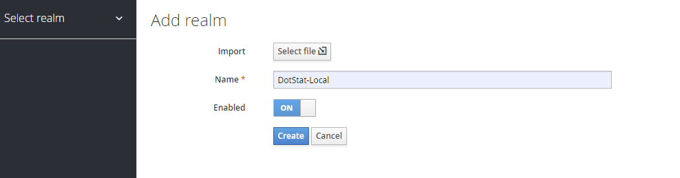

Once we hit "Create", we're catapulted into the realm itself, and we can start configuring it.

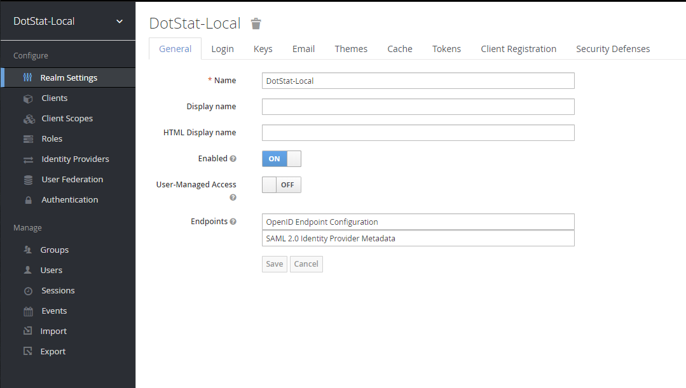

### Configuring the Realm

Before we even start talking about clients and users, there's a lot of configuration you can do with the realm. Most of these are not strictly speaking necessary for working with DotStat, so I'm going to gloss over them, but you may like to check out the Email tab (necessary if you want Keycloak to verify email addresses or reset passwords... essentially if you're not simply using it as a go-between for some other identity provider).

The only setting I'm going to draw particular attention to is "Require SSL" on the Login tab.

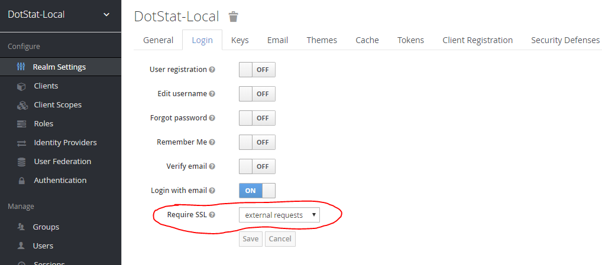

This setting controls under what circumstances attempts to log into (or any attempt to retrieve tokens) Keycloak must be made using a HTTPS connection. Mine is set on "external requests", which means as long as the request is being made from the same host as Keycloak, it's okay to make it over insecure HTTP. This suits me, because I can't be bothered setting up SSL. If your Keycloak is hosted on a different server to where the requests will be coming from, you're faced with two choices.

1. Set up SSL for your servers
2. Set the setting to "none"

Number 2 is a fine option if you're just playing around in a sandpit environment. However, under no circumstances should this **ever** be set to "none" in production. Keycloak is used by DotStat to provide OpenID and OAuth2 tokens. Both of these protocols **require** SSL to be secure.

### Creating a Client

I can see in your eyes the same confusion that was in mine when I first encountered clients. "But I want to register an application?!" I cried. However, client is one of the four "roles" (don't confuse this with roles in Keycloak) defined in the OAuth2 standard. It's an application making protected resource requests on behalf of the resource owner (in our case that's you, the end user of DotStat). Later when setting up a more complicated configuration of Keycloak, the client to requesting-application mapping doesn't quite work perfectly, but for now, it's great. The simplest way to set up Keycloak to work with DotStat is to use one Keycloak client to represent all the applications.

#### Aside: Tokens

As an aside, before we get stuck into the setup, let's briefly explore what it means for a DotStat application to "make protected resource requests on behalf of the resource owner". In the DotStat framework, the OpenID and OAuth2 (OpenID is an extension of OAuth2) protocols are used to secure access to "resources". A resource in DotStat could be an instance of the NSI services, or a specific dataflow within that service. Other services such as the [Transfer service](https://gitlab.com/sis-cc/.stat-suite/dotstatsuite-core-transfer) and [Authorization Management](https://gitlab.com/sis-cc/.stat-suite/dotstatsuite-core-auth-management) service also represent and contain resources.

All of these services, when secured, will require that every call to them is accompanied by something called a JWT Bearer token (JWT standing for JSON Web Token), which we'll often just refer to as a token. In the context of DotStat, this token will contain information about the end-user, including potentially their name, definitely their email, and a selection of "groups", which can be used by DotStat to determine access rights. If somebody has your token, to DotStat, they **are** you, or at least, can do everything you can do (this is why performing these protocols not over SSL is a recipe for disaster).

It's Keycloak's job to hand out these tokens, and prior to doing so, confirm that the requester of the token is in fact who they claim to be.

#### Back to Creating a Client

As the simplest setup for Keycloak, we're going to create one single client to represent all the applications in DotStat that will either need to check somebody is who they say they are, make requests on behalf of somebody, or check that whoever made a request has a token saying they're allowed to do what they're trying to do.

Luckily, creating a client is super easy. Click on the Clients button in the Configure menu, which will bring up a view of all currently-existing clients. You'll notice that there are already a bunch, probably the same ones I have below.

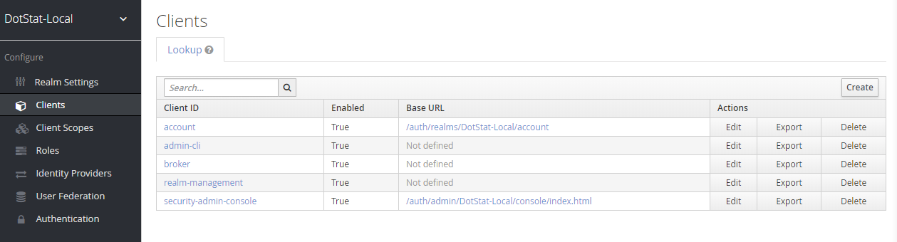

Now, we simply hit the "Create" button, and get taken to the Add Client screen (seen below). Here, much like the "Add Realm" screen, we have the option to import some JSON that defines our client, or fill in some starting details.

The client **must** have a "Client ID", as this is the unique (within the realm) identifier that applications will use when requesting or verifying tokens. I've chosen "DotStat-Applications", because it's for DotStat, and it's all applications. We also need to pick a Client Protocol, and we may provide a Root URL. The Client Protocol is what kind of token the applications are expecting to receive. Our options are openid-connect and saml. Obviously, because DotStat is set up to use OpenID and OAuth2, we'll be using openid-connect. The Root URL is not strictly-speaking necessary, but it will make our lives a little easier by configuring some other settings for us. This should be the root URL of whatever application will be "logging you in". For me, that's DLM, and my DLM is hosted at "http://localhost:7000". If you have multiple applications (say you're trying to get both DLM and Data Explorer to work), don't panic. Just pick one and use it for Root URL. I'll explain in a second why it's not too important.

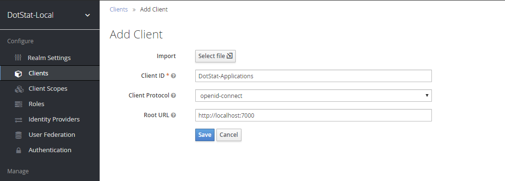

Hit "Save", and Keycloak will create the client, and dump us into its Settings page, where we can immediately become disoriented with the sheer volume of options. Luckily, because we're just trying to get things working, not secure, there's relatively little we have to change.

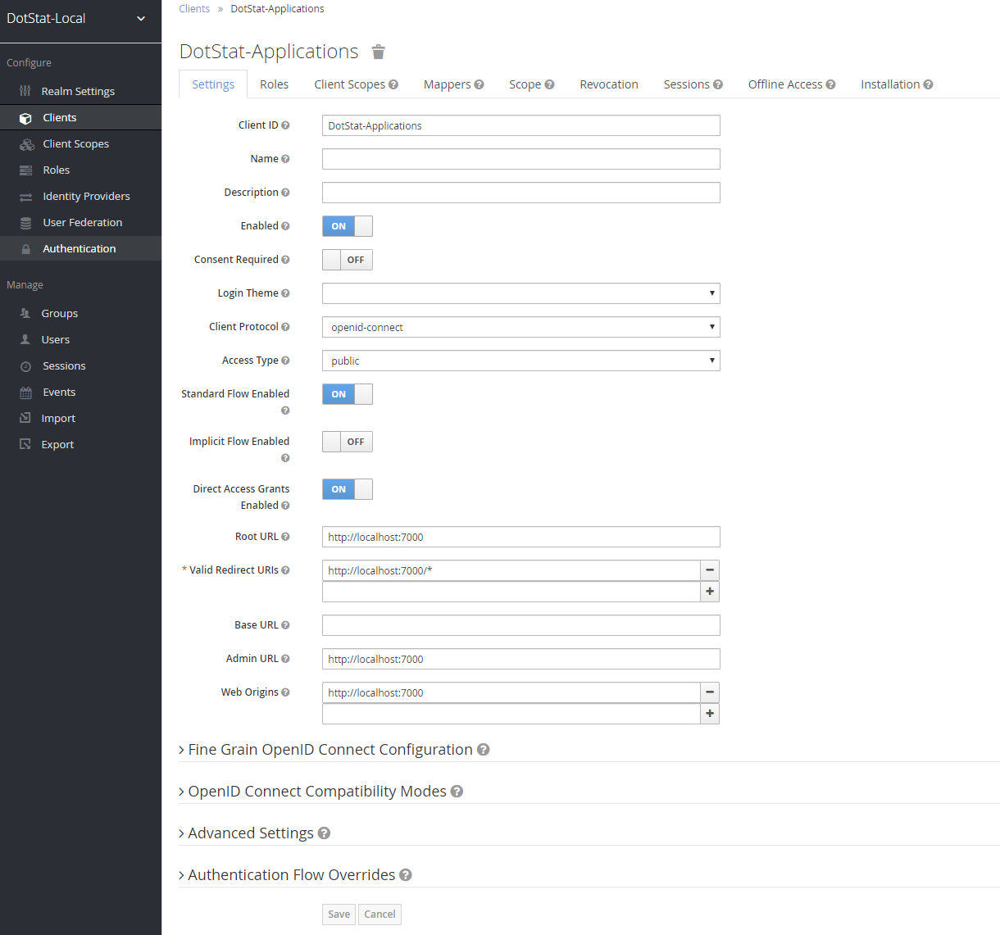.

### Configuring a Client

As we saw at the end of the last section, there are a **lot** of configuration settings for a new client. And that's even before going to the other tabs, or expanding any of the twisties! Luckily, if our aim is literally just to get things working and not securely (which it is), the client just needs three things (one of which is already done by default):

1. The client must have Access Type "public"
2. The client must have our application's root url followed by asterisk (eg http://localhost:7000/*) in the Valid Redirect URIs
3. The client must have our application's root url in the Web Origins list.

I know what you're thinking. "Hey, all that is already done for you in the screenshot you posted!" Yup, that's why it was worth setting the Root URL when we created the client. Keycloak took that Root URL and generated sensible values for a bunch of settings, including Valid Redirect URIs and Web Origins. It's also used if you provide relative URLs for any of these settings, to convert them to an absolute URL. So, with the Root URL of http://localhost:7000, a Valid Redirect URI of /* would become http://localhost:7000/*.

Now, I did promise that this would still be okay if you had multiple applications (say both DLM and Data Explorer), with different URLs (say DLM is hosted on http://localhost:7000 and Data Explorer on http://localhost:7005, or even on completely different servers!), and it will be okay! Because Valid Redirect URIs and Web Origins are lists, just add all required URLs. Below is a snap for if I was using both DLM and Data Explorer as described here.

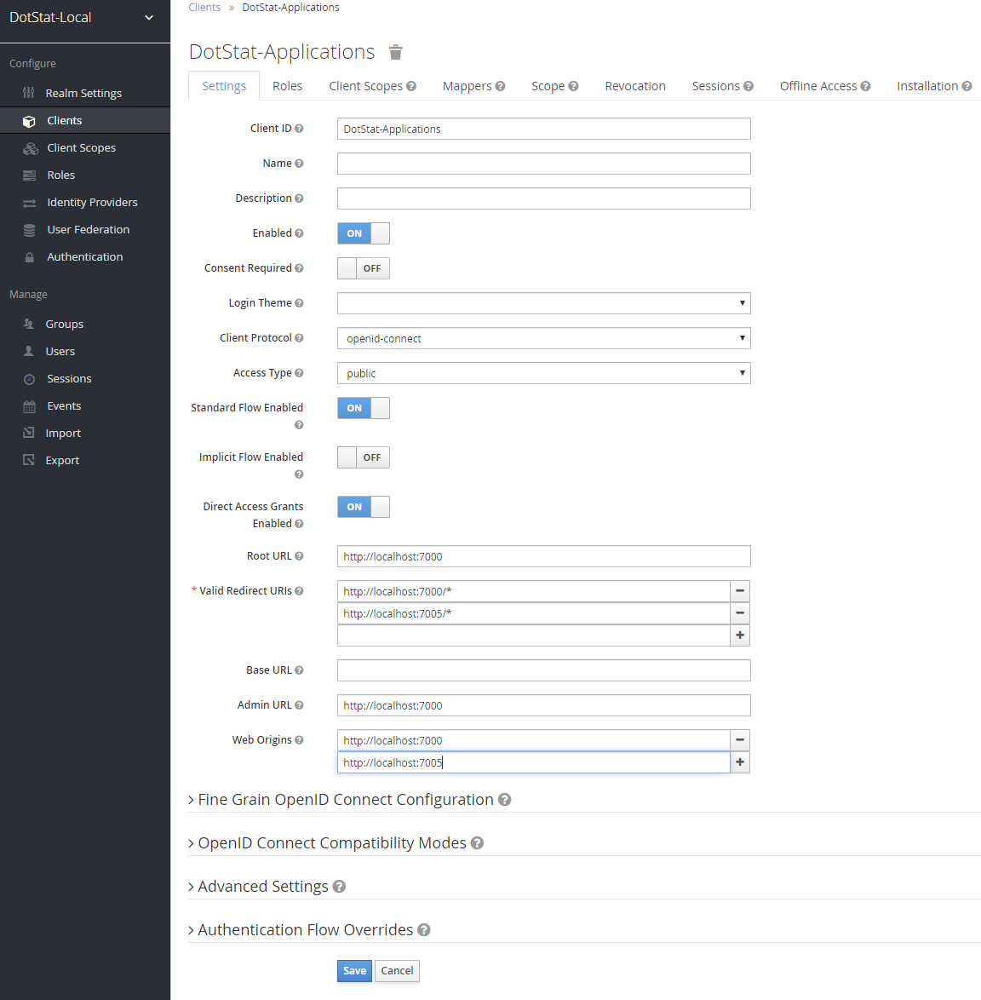

#### Aside: Access Type - public

The reason that we need our Access Type to be public, is because doing so lets applications use the client (like DLM asking it to log in a user) without providing a client secret. Client secrets are an extra layer of security to ensure that the application asking for a token (because the token goes to the application remember, not the end-user) are actually allowed to.

This client secret becomes a bit of an issue though when your application is entirely in the browser, like DLM and Data Explorer. Obviously you can't put the client secret in the browser... you may as well just print it on the screen at that point. So, when the application you're using Keycloak with is one of the browser-side DotStat applications, you need Access Type set to public.

#### Aside: Valid Redirect URIs

The list of Valid Redirect URIs is another security layer Keycloak employs, for a number of reasons. Generally it's pretty bad form to allow arbitrary redirects (users getting redirected to malicious sites), but also the way that oidc-connect clients work involve passing information of varying sensitivity through redirects. The DotStat JavaScript browser applications all use something called the Authorization Code Flow to get its tokens from Keycloak. Boiling this down a **lot** (as in to the point that it's meaningless for understanding the protocol), once you log in via Keycloak, the browser application won't actually get a token; it'll get an "authorization code" that it can exchange for a token or tokens (which not only prove who you are to say DLM, but also let it make calls on your behalf to other applications). Because DotStat requires "public" clients (see the previous aside for why), if this authorization code gets into somebody else's hands, they can use it to retrieve a token and impersonate you. One way this could happen is a malicious application sends a user to Keycloak, with themselves as the Redirect URI, so once they login, the malicious application gets the code. This can be mitigated by Keycloak checking the Redirect URI against a list of valid ones (which it does!).

So finally, that's why your application's root URL and star will need to be in that list, otherwise when the application tries to log you in using Keycloak, Keycloak won't let it.

#### Aside: Web Origins

This setting is all about [Cross-Origin Resource Sharing (CORS)](https://developer.mozilla.org/en-US/docs/Web/HTTP/CORS). CORS is great, but also very frustrating. Again, boiling this down to almost the point of inaccuracy, part of the dance the DotStat browser applications do with Keycloak to obtain their tokens involves them making a POST call to an endpoint on Keycloak, to exchange the authorization code they get from asking Keycloak to log you in for a token, which is what they **really** want. Because Keycloak is not hosted at the same origin (the port is included in determining whether an origin is the same) as the browser applications, the request needs to use CORS. So, Keycloak lets you provide a list of origins that are allowed to send requests. If your application's root url isn't in that list, when it tries to exchange the code for a token, the call will be disallowed by the browser.

#### Back to Configuring a Client

In order for DotStat to accurately perform authorization checks on incoming requests, it needs two claims in the token it receives from Keycloak. The first is the email address of the authenticated user, which is automatically added to the token by Keycloak. The second is which "groups" the user belongs to. Now, by default, DotStat will check a claim named "groups" in the token for a series of strings, which it will treat as the groups the user belongs to. Technically these strings could be sourced from pretty much anywhere. However, in this initial setup we'll be using the Keycloak Groups themselves, and sending Group Membership along with the token.

To set up the client to send Group Membership, we need to click on the Mappers tab, and add a Mapper. This will take us to the "Create Protocol Mapper" page, where we do the following:
- Name the mapper "Add-Groups", because that's what it does
- Change the mapper type to Group Membership
- Set "groups" as the Token Claim Name, because by default that's what DotStat expects
- Untick the "Full group path" option, because for otherwise the claim doesn't just contain the raw group names

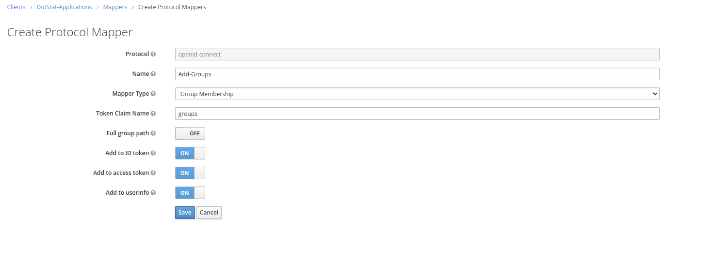]

### Creating a User

Now, if you were using Keycloak in anger, you'd probably be using it as an "Identity Broker", which is how the OECD is using it in their [tenanted deployment](https://sis-cc.gitlab.io/dotstatsuite-documentation/getting-started/devops/). When logging in, users are given the option to use other identity providers like Github, or Google, or Facebook or whoever, as opposed to typing in a username and password.

We're not going to do that, so we're going to create a user manually, so we can actually verify this is working. First up, go to the Users button in the Manage menu, and you'll be treated to a Users lookup page. Don't be fooled if this is empty even if you have users... you actually have the search, or hit "View all users" to see them. 

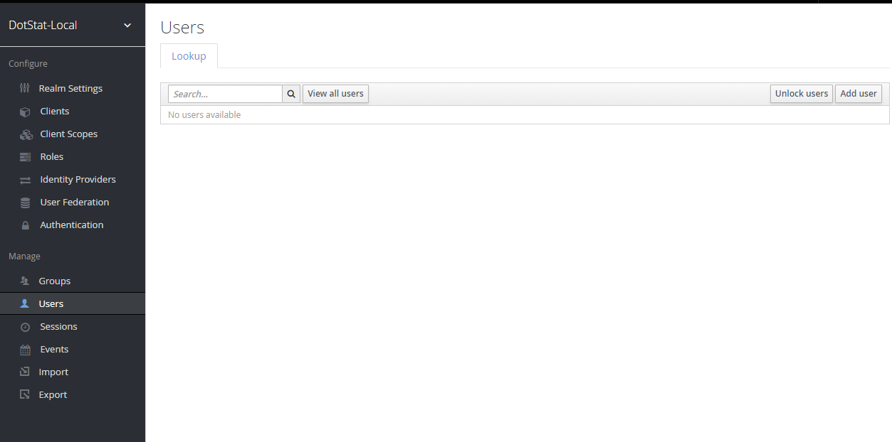

Now, click "Add user". This, oddly enough, will take us to the "Add user" page, where we can create our own identity. Keycloak requires only that we provide a Username, but if you want to use it with DotStat you'll need an Email too (this is what DotStat uses as the user id), and you may as well give yourself a first and last name. Make sure the user is enabled, and (because we never set up Keycloak to be able to email), set the Email Verified to "On".

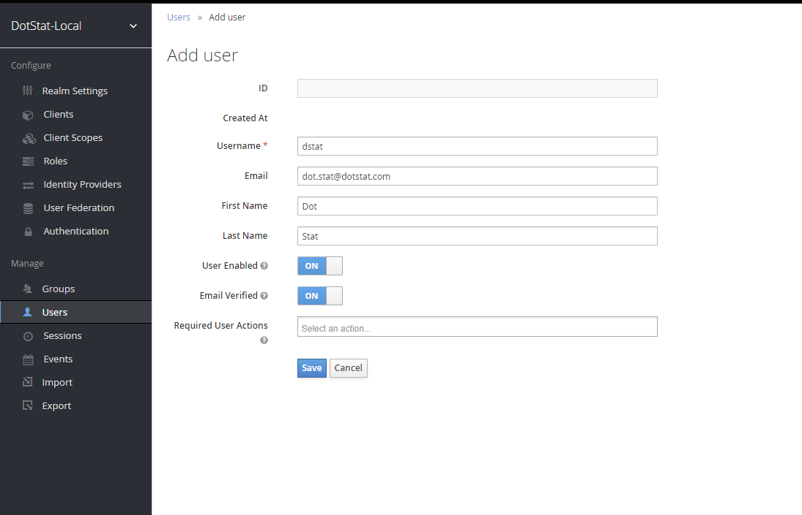

Hit "Save".

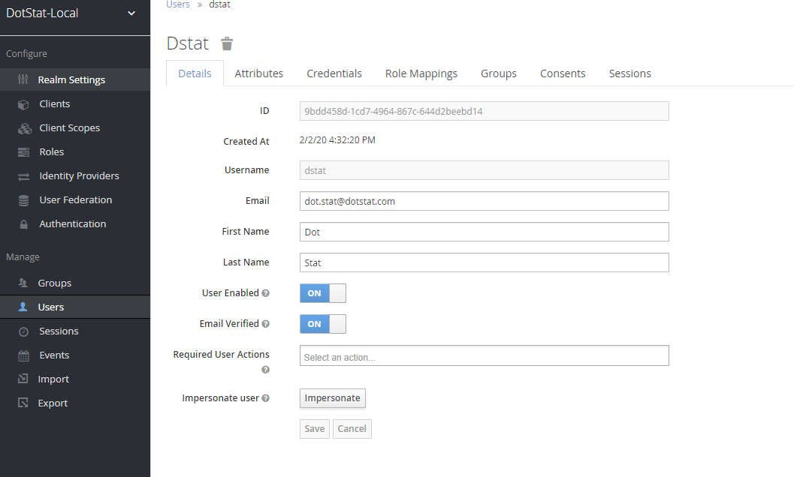

Fantastic. Now let's give our new user a password by going to the Credentials tab, entering a new password and unchecking Temporary. Hit "Reset Password".

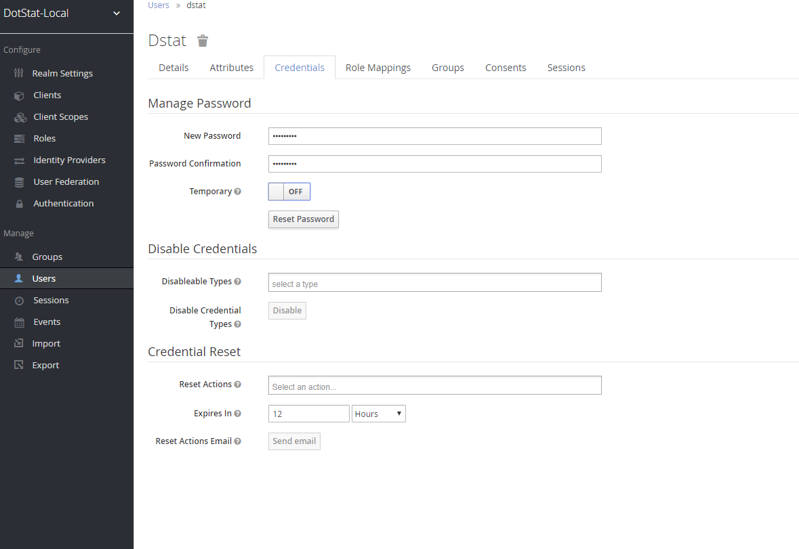

### Making the User an Administrator

In order for us to really begin using DotStat, we need to have a user that DotStat considers to be an administrator. The permissions a user has are controlled via rules in the [Authorization Management Service](https://sis-cc.gitlab.io/dotstatsuite-documentation/using-dlm/manage-user-access/). When you first start up DotStat there will be two rules. The first states that any user with the email "admin" is an administrator, and the second that any user with the group "admins" is an administrator. We'll be creating a Keycloak Group called "admins" and adding our user to it.

To create the group, we click on the Groups link in the left-hand navigation menu. From there we simply click "new", which lets us create a new group, called "admins".

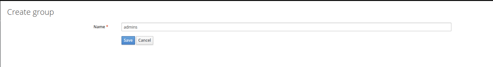

Once we have done this, we can navigate back to the user, click on their "Groups" tab, and add them to the "admins" group. Now, when a token is issued for the user it should contain the claim "groups" with the string "admins" in there, which will let DotStat know that they're an administrator.

### Making DotStat Use Your Keycloak

Okay, we're almost there. Keycloak is set up just the way we like it. But our DotStat applications aren't ready to use it. Luckily, that's not too hard. I'll run through the ones I know of in short order here.

#### The JavaScript Browser Applications

All of these will need two changes made, in two places.

First up, when starting them up, set the environment variable AUTH_SERVER_URL to the base url for your Keycloak server. For me, that's http://localhost:8080.

Secondly, you'll need to tell them what realm and client to use. This is done in the [tenants.json](https://gitlab.com/sis-cc/.stat-suite/dotstatsuite-config/blob/develop/data/prod/configs/tenants.json) file in your config server. If you're going with the [mono-tenant deployment](https://sis-cc.gitlab.io/dotstatsuite-documentation/install-source-code/monotenant-install-from-artifacts/) and hence don't have a proxy service, you'll need to update the "default" tenant. Otherwise you should know which tenant you're using, and update that one. You need to update the "keycloak" property to account for whatever you called your realm and client. In my example I called my realm "DotStat-Local" and my client "DotStat-Applications". So I'd have:

```javascript
"keycloak": { "realm": "DotStat-Local", "clientId": "DotStat-Applications" }
```