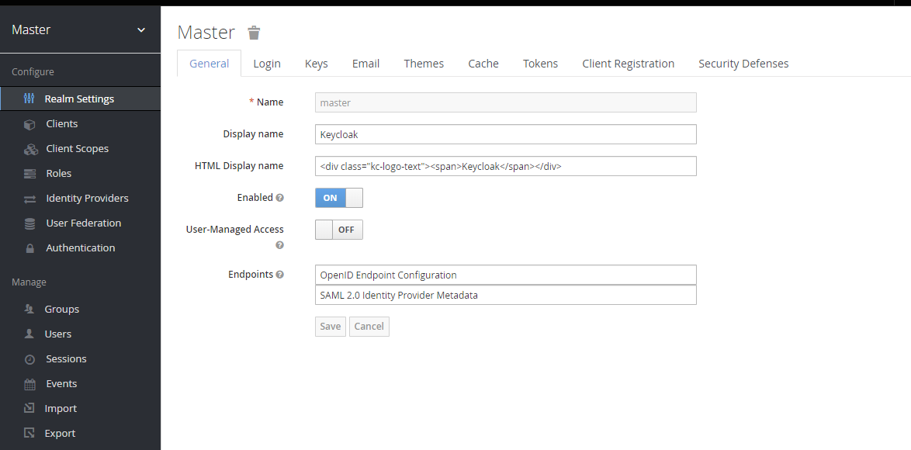

The purpose of this tutorial is to describe how to set up a Keycloak server to work with the DotStat .NET and JavaScript services. Obviously this means that in order to test this is all working, you'll need to have at least some of those services installed. Doing so is beyond the scope of this tutorial, but is described in the SIS-CC documentation pages both [from source](https://sis-cc.gitlab.io/dotstatsuite-documentation/install-source-code/) and [from containers](https://sis-cc.gitlab.io/dotstatsuite-documentation/install-docker/). I'm working with a single instance of the NSI web services, the [Data Lifecycle Manager](https://gitlab.com/sis-cc/.stat-suite/dotstatsuite-data-lifecycle-manager), the [JavaScript config service](https://gitlab.com/sis-cc/.stat-suite/dotstatsuite-config) and the built-in proxy that comes with the Data Lifecycle Manager.

## Installing Keycloak

The actual installation of the Keycloak server is beyond the scope of this tutorial, but I will give you a few pointers. First up, there are some instructions [on the SIS-CC documentation pages](https://sis-cc.gitlab.io/dotstatsuite-documentation/install-source-code/monotenant-install-js-as-windows-services/#keycloak) describing how to install it as a Windows service. Also, the [official Keycloak documentation](https://www.keycloak.org/docs/7.0/server_installation/#_standalone-mode) is great, if a little intimidating (due to the sheer number of options). For reference, I'm running it locally in standalone-mode, which is almost certainly what you need to do to.

Finally, and this is important, so I'm going to say it twice: use Keycloak version 7.0.0! The DotStat JavaScript services are written to work with this version, not the latest.

```
Use Keycloak version 7.0.0!
```

## Configuring Keycloak

When you first open up the Keycloak administrative console (mine was located at http://127.0.0.1:8080/auth/admin because I'm running it locally, but yours may vary), you'll be confronted with a page very similar to this:



This is the "master" realm. The "one realm to rule them all". A "realm" in Keycloak manages a set of users, credentials, roles and groups. This means that a user in one realm can't log into another, and is very useful for separating groups of applications. For instance, you could use one single Keycloak server for all your environments (DEV, QA and PROD etc) by having a different realm for each one.

### Creating a Realm

Now, it's [not recommended](https://www.keycloak.org/docs/latest/server_admin/#the-master-realm) to use the master realm to manage access to applications, so we're going to have to create a new realm. Luckily, that's dead easy. Simply mouse-over the "Master" dropdown in the top left-hand of the page, and select the "Add realm" button.


This will take you to the following screen, where you can either import some JSON defining your realm, or simply give it a name and create it. For our purposes you can name it whatever you want, but it should be meaningful. In the above example of using a different realm for each environment, you might name them DotStat-DEV, DotStat-QA and DotStat-PROD. Because I'm developing locally, I'm calling mine DotStat-Local. Obviously, leave the Enabled toggle set to "ON", otherwise you won't be able to use the realm.


