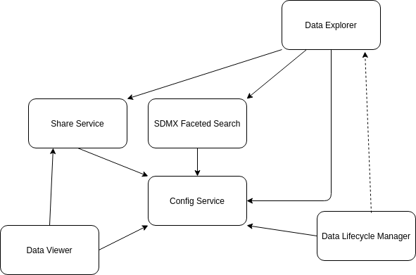
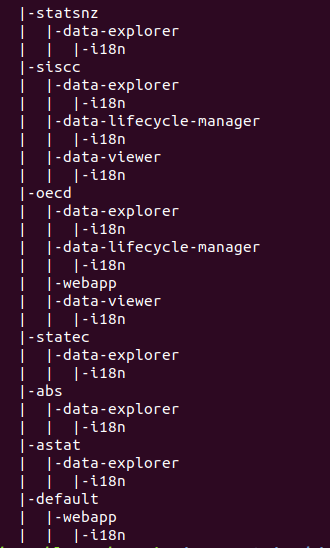
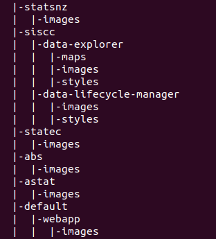

# Purpose

 The purpose of this document is to provide an overview of the solutions that make up the overall .Stat Suite, along with how the solutions fit together. It will focus heavily on information that would be useful for a developer or integration analyst setting up the .Stat Suite, and where possible will be technology-agnostic.

 The purpose of this is not a step-by-step set of instructions on installing and configuring the solution. Specific instructions are available in the [SIS-CC Documentation Pages](https://sis-cc.gitlab.io/dotstatsuite-documentation/) and in the individual solution repositories hosted [here](https://gitlab.com/sis-cc/.stat-suite). Rather, this document should provide an overview that makes following the individual instructions more meaningful and make debugging installation issues easier.

 # Some Background

 ## The .NET and JavaScript Split

 The .Stat Suite solutions can be divided into two groups:
 - The .NET Components, also known as the Core components, are all written in .NET Core, and generally consist of web APIs for managing and retrieving the contents of an SDMX [datasource](#datasources).
 - The JavaScript Components are all written in JavaScript (NodeJS and ReactJS) and generally have the purpose of supporting end-user interactions

 This split is not only important in terms of what infrastructure is required to run the groups, but because it is entirely possible to install the .NET Components without the JavaScript Components and vice versa (the exception to this is the [Data Lifecycle Manager](#data-lifecycle-manager), which expects to have .NET Components to call).

 Thus, we'll be splitting the descriptions of the .Stat Suite components along these lines.

 ## Datasources

The documentation around the JavaScript services often refers to datasources, and in fact it's one of the things you need to configure when you deploy them. Luckily, a datasource is pretty simple: it's a RESTful endpoint implementing the [SDMX REST API standard](https://github.com/sdmx-twg/sdmx-rest).

The .NET Components provide a datasource in the form of the [NSI Web Services](#nsi-services), so you have the option of deploying one or more sets of those as your datasource(s). However, a datasource could also be hosted by another organisation, and implemented in an entirely different framework.

### Datasources - Extra Requirements

This will be described more in each individual solution's description, but in addition to implementing the SDMX REST API standard, a datasource must at this stage meet the following criteria:
- Be accessible from wherever users will be accessing the JavaScript frontends (generally this means from their personal computer and thus the open internet, but in enterprise situations there's likely to be firewall or proxy changes required)
- Be accessible from wherever the [SDMX Faceted Search](#sdmx-faceted-search) is hosted, and if using HTTPS, its certificate must be trusted by the SDMX Faceted Search application.
- Allow anonymous access (at this stage the [Data Explorer](#data-explorer) and [Data Viewer](#data-viewer) applications do not support non-anonymous requests)

 ## Tenants

 The concept of a *tenant* is something you'll need to keep in mind when deploying and configuring the JavaScript components. Conceptually tenants represent organisations or groups sharing instances of the JavaScript solutions, but using their own themes and configurations.

 From a deployment and configuration point of view though, a tenant is just a collection of configuration settings (not all settings can differ between tenants, and not all JavaScript solutions are tenant-aware {Nicolas-Review}). The key thing you'll need to consider when deploying and configuring the JavaScript components is the following question:

 ```
 Do I need multiple tenants (sets of configurations) or do I only need the one?
 ```

The answer to this question can fundamentally change how you perform the deployment. We'll get to that in specific services.

### Which Tenant is This Request For?

Tenant-enabled JavaScript components (currently [Data Explorer](#data-explorer), [Data Viewer](#data-viewer) and [Data Lifecycle Manager](#data-lifecycle-manager)) all expect to see something in each request that identifies which tenant the request pertains to. This is done by passing the tenant id (for example, 'oecd') in either the 'x-tenant' header, or in the 'tenant' query-string parameter. How this gets set, and what happens if it isn't, is described later in the deployment instructions.

# The JavaScript Components

As described previously, the JavaScript components are all geared towards the end-user experience, accessing or administering SDMX via a browser. The including applications are (in rough order of increasing dependency):
- [Config Service](#config-service)
- [Proxy Service](#proxy-service)
- [SDMX Faceted Search Service](#sdmx-faceted-search)
- [Share Service](#share-service)
- [Data Viewer](#data-viewer)
- [Data Explorer](#data-explorer)
- [Data Lifecycle Manager](#data-lifecycle-manager)

Although the [Data Lifecycle Manager](#data-lifecycle-manager) is listed here, it is so tightly-coupled to the .NET Components that we'll only discuss it after describing both sets of components.

The following diagram indicates the dependencies that the components have on one another. By saying a component is *dependent* on another, I mean that an instance of the former will not function correctly when deployed without an instance of the latter to refer to. In the diagram, a solid line indicates a direct connection is required. A broken line indicates that the dependencies is referential (the component doesn't need to be able to reach its dependency).



```
Note: As we'll find out later, the Proxy Service is sort of dependent on all the other components, but it will always depend on the Config Service.
```

## Third-Party Dependencies

In addition to having dependencies on one another, the JavaScript components have dependencies on third-party products. These are:
- [Solr](#solr): The [SDMX Faceted Search Service](#sdmx-faceted-search) must be able to reach an appropriately configured instance of the [Apache Solr](https://lucene.apache.org/solr/) search platform
- [Redis](#redis): Both the [SDMX Faceted Search Service](#sdmx-faceted-search) and the [Share Service](#share-service) must be able to reach an appropriately configured instance (or instances... there's no obligation to share an instance) of the [Redis](https://redis.io/) in-memory database
- [Keycloak](#keycloak): In order to support authentication and authorization, the [Data Lifecycle Manager](#data-lifecycle-manager) expects there to exist an appropriately-configured [Keycloak](https://www.keycloak.org/) server. Note: connections to the Keycloak server are made through the browser, so DLM doesn't need a direct connection.

## Config Service

### Repository
[dotstatsuite-config](https://gitlab.com/sis-cc/.stat-suite/dotstatsuite-config)

### Depends On
The Config Service does not depend on any other JavaScript or third-party components.

### Depended On By
- [Proxy Service](#proxy-service): Direct connection required
- [SDMX Faceted Search Service](#sdmx-faceted-search): Direct connection required
- [Data Viewer](#data-viewer): Direct connection required
- [Data Explorer](#data-explorer): Direct connection required
- [Data Lifecycle Manager](#data-lifecycle-manager): Direct connection required

### End-User Accessibility

The assets path of the Config Service at minimum must be accessible from the user's browser for [Data Explorer](#data-explorer), [Data Viewer](#data-viewer) and [Data Lifecycle Manager](#data-lifecycle-manager) to function correctly.

### Configuration Tips

The Config Service is very light on configuration, because it **is** the source of it for so many other services.

Like most of the JavaScript components, you can specify what host and port the service should listen on. For the Config Service this is done with the following environment variables:
- `HOST`: Sets the host to listen on.
- `PORT`: Which port the service will listen on.

The `NODE_ENV` environment variable lets the service know whether it's running in development, test or production.

### Description

The Config Service provides all save one (the [Proxy Service](#proxy-service)) of the other JavaScript components with their configuration. It also serves up any tenant-specific assets (like images, css files, etc) that they need (this is how the Proxy Service takes a dependency on it). At it's core, the Config Service is just a simple HTTP file server, serving configuration as JSON and other files as... other files.

Although the Config Service is how differences between [tenants](#tenants) are managed, it itself isn't actually **aware** of tenants, per se. The magic is managed by how the configuration files and asset files are organised on the server.

#### Configuration Files

The configuration files are stored in the *configs* folder in the deployed config service. In this folder are two files, and some number of folders. The two files are the only two configuration files that do not vary based on tenant:
- [datasources.json](#datasources-file): This file describes all the [datasources](#datasources) available to the JavaScript components, as well as some extra information about them relevant largely to the [SDMX Faceted Search Service](#sdmx-faceted-search)
- [tenants.json](#tenants-file): This file lists all the available tenants, as well as potentially some information about how their authentication works

All the other configuration files are stored in subfolders classified by first which tenant they apply to, and then which application. From there, they're free to be organised however the application using them expects them to be. Generally, there will be a *settings.json* file containing general settings for the application, and likely an *i18n* subfolder containing multi-lingual resource text (e.g. for saying "No search result" in however many languages are supported). 

Let's look an example. Let's say we want the settings file for Data Explorer, for the tenant with the id 'alakazam'. We would host it at 'configs/alakazam/data-explorer/settings.json'.



The above screenshot shows a configs folder with a number of tenants, supporting a number of applications.

The application part of the folder path is determined by the `appId`, a unique identifier each application is assigned. The current identifiers are:
- data-explorer: The [Data Explorer](#data-explorer) application
- data-lifecycle-manager: The [Data Lifecycle Manager](#data-lifecycle-manager) application
- data-viewer: The [Data Viewer](#data-viewer) application

#### Asset Files

The asset files are stored in the *assets* folder in the deployed config service. In principle, like the configuration files, the assets are stored in subfolders classified by first which tenant they apply to, and then which application. However, you only have to look at the [Config Service repository](https://gitlab.com/sis-cc/.stat-suite/dotstatsuite-config/-/tree/develop/data/prod/assets) to see that this is not adhered to. {Nicolas-Review}



The reason for this is that for a lot of the assets (images especially), the path to them is set in the appropriate settings configuration file, as relative from the assets root (e.g. `/assets/siscc/data-explorer/images/sis-cc-logo.png`), so there's no absolute **need** to structure their location any particular way, unlike the location of configuration files.

```
NOTE: It's only possible to use a relative path to assets if the Proxy Service is being used!
```

#### Datasources File

The following is the datasources.json file in the Config Service repository, cut down to avoid unnecessary duplication. It will serve to explain how the file is used:

```javascript
{
  "SIS-CC-stable": {
    "url": "http://nsi-stable-siscc.redpelicans.com/rest",
    "version": "1.0",
    "categorySchemeId": "OECDCS1",
    "agencyId": "OECD",
    "hasRangeHeader": true,
    "supportsReferencePartial": true,
    "label": "SIS-CC-stable",
    "indexed": true
  },
  "SIS-CC-reset": {
    "url": "http://nsi-reset-siscc.redpelicans.com/rest",
    "version": "1.0",
    "categorySchemeId": "none",
    "agencyId": "OECD",
    "hasRangeHeader": true,
    "supportsReferencePartial": true,
    "label": "SIS-CC-reset",
    "indexed": false
  }
```

The file takes the form of a JSON object, with one property for each datasource you want to be available to the JavaScript components. The property name becomes the `id` of the datasource. The datasource objects themselves provide the following information:
- A url, via the `url` property, which is always the base URL of the RESTful API (which must implement the SDMX REST API standard). In the case of the [NSI Services](#nsi-services), it'll always end with `/rest`.
- A human-readable label for the datasource, provided by the `label` property. This will be displayed to the end-user in various user-interfaces.
- Whether the datasource should be indexed by the [SDMX Faceted Search Service](#sdmx-faceted-search), indicated by the `indexed` property.
- If the datasource is "indexable", a category scheme must be provided. Why precisely will be explained in the [SDMX Faceted Search Service](#sdmx-faceted-search) section, but it's defined precisely via the `agencyId`, `categorySchemeId` and `version` properties. The `version` property can be set to "latest" to always get the latest version of the category scheme. {Nicolas-Review}
- Whether the datasource supports the Range HTTP Header, specified with the `hasRangeHeader` boolean. The Range header is used for paging results, and is an extension to the SDMX REST API standard, hence needing to specify if it's supported or not.
- Whether the datasource supports the "referencepartial" value for the "details" query-string parameter, specified with the `supportsReferencePartial` boolean. See [here](https://github.com/sdmx-twg/sdmx-rest/wiki/Metadata-queries#the-detail-query-parameter-defining-the-amount-of-details) for a description of its use.

#### Tenants File

The following is the tenants.json file in the Config Service repository, cut down to avoid unnecessary duplication. It will serve to explain how the file is used:

```javascript
{
  "default": {
    "id": "default",
    "name": "default"
  },
  "oecd": {
    "id": "oecd",
    "name": "OECD",
    "keycloak": { "realm": "OECD", "clientId": "app" }
  },
  "siscc": {
    "id": "siscc",
    "name": "SISCC",
    "keycloak": { "realm": "OECD", "clientId": "app" }
  }
}
```

Like the [datasources file](#datasources-file), the file takes the form of a JSON object, with one property for each tenant available for use. The property name must match the `id` of the tenant {Nicolas-Review}. Other than the `id` property, the tenant object provides only:
- A human-readable name for the tenant, via the `name` property
- Optionally, some authentication configuration, in the `keycloak` property. The `keycloak` property is itself a JSON object, specifying the `realm` and `clientId` that should be used by JavaScript components when authenticating clients and making authorized calls to backend services

### Deployment Tips

- Because the configuration files and assets are baked into the solution, if you're deploying from [built artefacts](https://sis-cc.gitlab.io/dotstatsuite-documentation/install-source-code/monotenant-install-from-artifacts/) or [containers](https://sis-cc.gitlab.io/dotstatsuite-documentation/install-docker/) you'll need to remember to delete them and replace them with your own. Mounted volumes is a great way to do this with containers
- See more details in the [no proxy topology](#no-proxy-topology) section, but if you're deploying without a proxy, you'll need to use the full path (including server hostname) for all assets

## Proxy Service

### Repository
[dotstatsuite-proxy](https://gitlab.com/sis-cc/.stat-suite/dotstatsuite-proxy)

### Depends On
- [Config Service](#config-service): Direct connection required

The Proxy Service can also sort of depend on other configured JavaScript Component services. See the [Proxy Routing](#proxy-routing) section for more information.

### Depended On By

No other components depend directly on the Proxy Service, however, the default installation scenario assumes you have it set up in front of all services.

### End-User Accessibility

The Proxy Service must be end-user accessible.

### Configuration Tips

The Proxy Service is very light on configuration, because it is very limited in its functionality.

Routing to applications and tenants is set in the `data/routes.json` file.

Unlike most of the other JavaScript components, you can only specify what port the service should listen on. This is because the proxy needs to pick up **all** incoming requests regardless of host. Set the port with the following environment variable:
- PORT: Which port the service will listen on.

Use the `CONFIG_URL` to tell the Proxy Service where to find the [Config Service](#config-service). This should be the URL that the Proxy Service uses to connect to it, **not** where the Config Service is hosted from the user's point of view. For example, if hosted on the same box, it might be `http://localhost:5007`.

The `NODE_ENV` environment variable lets the service know whether it's running in development, test or production.

The Proxy Service does not use the Config Service to obtain any configuration.

### Description

The Proxy Service is intended to sit in front of the rest of the JavaScript Components and provide tenant-aware routing. The way this works is as follows:
- All requests to any JavaScript component come through the proxy
- Upon receiving a request, assuming it's not a health check or for a static asset (see [Proxy Routing](#proxy-routing) for details), the proxy captures the hostname of the request
- The hostname is compared against a configured routing list, and if a match is found, that provides a target address and potentially a tenant (the tenant "default" is used if one is not provided)
- The request is forwarded to the target, with a header set telling the target what tenant to serve the request for

As hinted at in the tenant-aware routing steps, the Proxy Service also is responsible for making sure any requests for static asset files are directed appropriately to the [Config Service](#config-service).

### Proxy Routing

Assuming an incoming request is neither a health check or asset request (see the sections below on those), normal routing rules apply.

How does the proxy decide which requests to route to which components? This information is encoded in the [routes.json](https://gitlab.com/sis-cc/.stat-suite/dotstatsuite-proxy/-/blob/develop/data/routes.json). Due to the fact that this linked file is specific to the OECD's hosted environment (which has multiple layers of ingress) it can be a little hard to extrapolate from. Let's look at a made-up example instead:
```javascript
{
  {
    "host": "dataexplorer-alakazam.com",
    "target": "http://localhost:7000",
    "tenant": "alakazam"
  },
  {
    "host": "dataexplorer-opensesame.com",
    "target": "http://localhost:7000",
    "tenant": "opensesame"
  },
  {
    "host": "dataviewer-alakazam.com",
    "target": "http://localhost:7001",
    "tenant": "alakazam"
  },
  {
    "host": "dataviewer-opensesame.com",
    "target": "http://localhost:7001",
    "tenant": "opensesame"
  }
}
```

In this example, we're supporting a [Data Explorer](#data-explorer) and [Data Viewer](#data-viewer) instance, with two possible tenants. Our proxy is hosted on the same server as the two actual installations of the applications (because our target is localhost).

So, if a request comes into the proxy with the hostname `dataexplorer-alakazam.com` it will get forwarded to whatever is listening on port 7000 in localhost. In order to tell what is presumably an instance of Data Explorer which tenant to serve up, the proxy attaches a `x-tenant` header with the value "alakazam".

Of course, you've probably noted the issue here. You'll have to set up DNS rules of some sort so that all four of those hostnames all are routed to the same server.

#### Proxy Routing - Healthcheck

The first thing that the proxy checks when it receives a request is whether it's actually somebody checking the health of the proxy. It does this by checking if the path of the request begins with `/_healthcheck_` (it also allows terminating with a `/` or `?`). If so, it doesn't forward it on, and just reports back its healthcheck.

#### Proxy Routing - Assets

The second thing that the proxy checks when it receives a request is whether it's for a static asset. Static assets are hosted by the [Config Service](#config-service), to allow them to vary between tenants. If a request's path starts with `/assets` (it also allows terminating with a `/` or `?`, though the latter would be confusing), it will not go through the normal routing process (as the target application doesn't actually host the assets). Instead, the request is forwarded to the [Config Service](#config-service).

For example, suppose the full request received by the proxy was `https://dataviewer-opensesame.com/assets/img/logo.png`. If that request was forwarded using the [proxy routing](#proxy-routing) rules, it would end up at an application that couldn't serve it. Instead, it's forwarded to the Config Service. If that was hosted at localhost:5007, the forwarded request would be `http://localhost:5007/assets/img/logo.png`.

This asset routing is exactly why deploying without a proxy (usually because you have only one tenant) requires some changes to configuration, which is described in the [no proxy topology](#topologies-no-proxy) section.

#### Proxy Routing - Advanced

Technically, the "host" property in the `routes.json` file is a regular expression, so it is possible to perform relatively complicated matches. One possibility would be to alias a tenant or application name.

### Deployment Tips

- Because the `routes.json` is baked into the solution, if you're deploying from [built artefacts](https://sis-cc.gitlab.io/dotstatsuite-documentation/install-source-code/monotenant-install-from-artifacts/) or [containers](https://sis-cc.gitlab.io/dotstatsuite-documentation/install-docker/) you'll need to remember to delete it and replace it with your own. Mounted volumes is a great way to do this with containers

## SDMX Faceted Search

### Repository
[dotstatsuite-sdmx-faceted-search](https://gitlab.com/sis-cc/.stat-suite/dotstatsuite-sdmx-faceted-search)

### Depends On
- [NSI Web Services](#nsi-services): Direct connection required
- [Config Service](#config-service): Direct connection required
- [Solr](#solr): Direct connection required
- [Redis](#redis): Direct connection required

### Depended On By

- [Data Explorer](#data-explorer): Connection through browser required

### End-User Accessibility

The SDMX Faceted Search must be end-user accessible (although you can block the admin sub-paths if you like).

### Configuration Tips

The SDMX Faceted Search has a bewildering array of configuration, but almost certainly you will not be using much of it.

The SDMX Faceted Search uses the Config Service to retrieve a list of datasources to index, from the [datasources file](#datasources-file).

Unlike most of the other JavaScript components, you can only specify what port the service should listen on. Set the port with the following environment variable:
- `PORT`: Which port the service will listen on.

Use the `CONFIG_URL` environment variable to tell the SDMX Faceted Search service where to find the [Config Service](#config-service). This should be the URL that the SDMX Faceted Search Service uses to connect to it, **not** where the Config Service is hosted from the user's point of view. For example, if hosted on the same box, it might be `http://localhost:5007`.

Use the `REDIS_HOST` and `REDIS_PORT` environment variables to tell the SDMX Faceted Search service where to find the [Redis](#redis) instance it is supposed to be using to cache dynamic configuration.

Use the `SOLR_HOST` and `SOLR_PORT` environment variables to tell the SDMX faceted Search service where to find the [Solr](#solr) instance. You can also specify what Solr core it should use with `SOLR_CORE`, but it's unlikely you'll need that different than the default of 'sdmx-facet-search'.

The `NODE_ENV` environment variable lets the service know whether it's running in development, test or production.

The administrative APIs (used to control indexing and retrieve reports) are secured through an API key, which should be set with the `API_KEY` environment variable to something hard to guess.

```
ALERT! Always specifically set the API_KEY environment variable in production!
```

### Description

The SDMX Faceted Search service is intended to enable users (at this stage through [Data Explorer](#data-explorer)) to perform "faceted searches" of dataflows stored in SDMX [datasources](#datasources). A decent definition of faceted search can be [found on Wikipedia](https://en.wikipedia.org/wiki/Faceted_search), but essentially think of applying a series of extra filters to a normal search. So, you might be searching for "running shoes", and one facet you could add to filter on could be "brand", with a selection of brands, and another could be "price", with some price bands.

The service enables this by leaning heavily on a Solr instance to index dataflows from [datasources](#datasources) defined in the [Config Service's](#config-service) [datasources file](#datasources-file). The service also uses Redis to cache dynamic configuration values.

### Deployment Tips

- At this stage, there's no built-in service bus or job for re-indexing the SDMX Faceted Search. This means that as new dataflows are added to your datasource, they won't be picked up. Consider setting up a scheduled job (even just a cron job) that sends a POST request to http://search-service-url/admin/dataflows?api-key=yourapikey (see the configuration tips for what the API key is).

## Share Service

### Repository
[dotstatsuite-share](https://gitlab.com/sis-cc/.stat-suite/dotstatsuite-share)

### Depends On
- [Redis](#redis): Direct connection required
- Some sort of mail service (at the moment it is hardcoded to use RedPelican's MailGun instance)

### Depended On By

- [Data Explorer](#data-explorer): Connection through browser required
- [Data Viewer](#data-viewer): Connection through browser required

### End-User Accessibility

The Share Service must be end-user accessible.

### Configuration Tips

Unlike the other JavaScript components, absolutely no configuration is done via the [Config Service](#config-service). {Nicolas-Review}

Like most of the JavaScript components, you can specify what host and port the service should listen on. For the Share Service this is done with the following environment variables:
- `HOST`: Sets the host to listen on.
- `PORT`: Which port the service will listen on.

Use the `REDIS_HOST` and `REDIS_PORT` environment variables to tell the Share Service where to find the [Redis](#redis) instance it is supposed to be using to store chart and table definitions.

The `NODE_ENV` environment variable lets the service know whether it's running in development, test or production.

There are two "secret-setting" environment variables, `API_KEY` and `SECRET_KEY`. As near I can tell, the `API_KEY` variable is never actually used ({Nicolas-Review}), but the `SECRET_KEY` is very important, as it's used as part of the chart confirmation process (see [Chart Confirmation](#chart-confirmation) for more). Set it to something with high entropy.

If doing a proper deployment (not just localhost for messing about), you'll almost certainly need to set the `SITE_URL` environment variable to the externally-visible  URL of your service, so that confirmation emails carry the correct URL. For example, say the Share Service is hosted externally on "https://share-service.org/share", that's what you should set your `SITE_URL` variable to. ({Nicolas-Review}: I think this will work with subfolders, but can you confirm?)

It is possible to also provide a `CONFIRM_URL` environment variable, but this is only used if chart-creation requests don't include a confirmation url, which they always do ({Nicolas-Review}) so you can safely exclude this.

It would be good if you could alter how the emails are sent, but you can't, because it's hardcoded. {Nicolas-Review}

### Description

The Share Service allows users to save and share charts and tables they've built through [Data Explorer](#data-explorer). It does this by saving their definition or even literally data in a [Redis](#redis) database. Whether it saves the table/chart definition or data depends on whether the user wants the saved chart/table to always show the latest data, or a snapshot.

In order to avoid naughty or incompetent users just spamming the service and overloading your infrastructure, the service implements an IP rate limit. Additionally, table/chart definitions are only stored for a period of time unless creation is confirmed via an email.

### Chart Confirmation

What follows is a very brief explanation of the chart sharing process in regards to confirmation. This will focus only on the parts of the process that are relevant to deployment and configuration.

When a request is received to save a chart/table for sharing, it does not immediately become available ({Nicolas-Review} - actually it becomes available but no data is returned, which causes [Data Viewer](#data-viewer) to break). Instead, it's saved temporarily in [Redis](#redis), and a confirmation email is generated (all requests to save charts/tables must be accompanied by an email). The url the email recipient follows to "confirm" the request is generated by encoding the chart/table id (an increasing integer) inside a [JWT](https://en.wikipedia.org/wiki/JSON_Web_Token), signed using the `SECRET_KEY` environment variable.

The JWT provided in the "confirm url" is set to expire after a set period of time, after which the user can no longer confirm the request. This period of time corresponds also to how long the temporary data will exist in Redis. So, if the confirm url is never visited, Redis will automatically delete the data, helping to avoid overloading the server memory. If it is visited, the chart/table data in Redis becomes persistent.

## Data Viewer

### Repository
[dotstatsuite-data-viewer](https://gitlab.com/sis-cc/.stat-suite/dotstatsuite-data-viewer)

### Depends On
- [Share Service](#share-service): Connection through browser required
- [Config Service](#config-service): Direct connection and connection through browser required

### Depended On By

No components depend directly on the Data Viewer, although the [Share Service](#share-service) shared charts/tables are only viewable if it exists.

### End-User Accessibility

The Data Viewer must be end-user accessible.

### Configuration Tips

The Data Viewer sources a large amount of its configuration from the [Config Service](#config-service), and a lot of them will vary based on what tenant the application is serving. The majority of these are sourced from its settings.json file. This file is tenanted, which means depending on which tenant the Data Viewer is told it's acting as, it will retrieve a different settings.json file from the Config Service. It will always request the file with the following pattern:
```
{CONFIG_URL}/{tenant}/data-viewer/settings.json
```

Use the `CONFIG_URL` environment variable to tell the Data Viewer where to find the [Config Service](#config-service). This should be the URL that the Data Viewer uses to connect to it, **not** where the Config Service is hosted from the user's point of view. For example, if hosted on the same box, it might be `http://localhost:5007`. If hosted in the same Docker network it might be http://config, assuming `config` is what the Config Service container name is.

The `NODE_ENV` environment variable lets the service know whether it's running in development, test or production.

Like most of the JavaScript components, you can specify what host and port the service should listen on. For the Data Viewer this is done with the following environment variables:
- `SERVER_HOST`: Sets the host to listen on.
- `SERVER_PORT`: Which port the service will listen on.

Although the facility exists to specify a secret key with the `SECRET_KEY` environment variable, it's not used anywhere ({Nicolas-Review}), so don't worry about it.

### The Settings File

Some configuration of the Data Viewer application is done through the settings.json file (held in the [Config Service](#config-service)). It's likely that you'll need to set at least the following value:
```javascript
"share": {
    "endpoint": "http://localhost/share-service"
  },
```

The `share:endpoint` property is used to tell the Data Viewer how to contact the [Share Service](#share-service) for the purpose of retrieving chart and table definitions for display. Because this is done from the browser, make sure to use the location the Share Service is viewable from the browser, **not** from the Data Viewer application itself.

### Description

The Data Viewer application is intended to display a single chart or table shared via the [Share Service](#share-service). The chart/table is not alterable like it would be if viewed in [Data Explorer](#data-explorer).

As Data Viewer is a largely browser-based application, it retrieves chart/table definitions from the [Share Service](#share-service) by the user's browser calling the Share Service's API.

Like the [Data Explorer](#data-explorer), the Data Viewer relies on assets (such as CSS files or images) hosted by the [Config Service](#config-service).

### Deployment Tips

- If using the pre-built Data Viewer container, the application **expects** to be hosted at server root. That is, if the domain name it's hosted at is `https://dotstat.organisation.org`, Data Viewer will not behave properly if it's hosted from a subfolder, like `https://dotstat.organisation.org/data-viewer`.
- If built from source, you can set the subfolder you want to host Data Viewer from, when building it, in the usual way for setting React apps homepage.

## Data Explorer

### Repository
[dotstatsuite-data-explorer](https://gitlab.com/sis-cc/.stat-suite/dotstatsuite-data-explorer)

### Depends On
- [NSI Web Services](#nsi-services): Connection through brower required
- [Share Service](#share-service): Connection through browser required
- [SDMX Faceted Search](#sdmx-faceted-search): Connection through browser required
- [Config Service](#config-service): Direct connection and connection through browser required

### Depended On By

No components depend directly on the Data Explorer.

### End-User Accessibility

The Data Explorer must be end-user accessible.

### Configuration Tips

The Data Explorer sources a large amount of its configuration from the [Config Service](#config-service), and a lot of them will vary based on what tenant the application is serving. The majority of these are sourced from its settings.json file. This file is tenanted, which means depending on which tenant the Data Explorer is told it's acting as, it will retrieve a different settings.json file from the Config Service. It will always request the file with the following pattern:
```
{CONFIG_URL}/{tenant}/data-explorer/settings.json
```

Use the `CONFIG_URL` environment variable to tell the Data Explorer where to find the [Config Service](#config-service). This should be the URL that the Data Explorer uses to connect to it, **not** where the Config Service is hosted from the user's point of view. For example, if hosted on the same box, it might be `http://localhost:5007`. If hosted in the same Docker network it might be http://config, assuming `config` is what the Config Service container name is.

The `NODE_ENV` environment variable lets the service know whether it's running in development, test or production.

Like most of the JavaScript components, you can specify what host and port the service should listen on. For the Data Explorer this is done with the following environment variables:
- `SERVER_HOST`: Sets the host to listen on.
- `SERVER_PORT`: Which port the service will listen on.

The `AUTH_SERVER_URL` should be the base URL at which Keycloak is accessible **from the user's browser**. So, you want the protocol and hostname that the browser would use to connect to it, not what Data Explorer would use. For example, if you're running everything locally, it might be `https://localhost:8080`.

### The Settings File

Some configuration of the Data Explorer application is done through the settings.json file (held in the [Config Service](#config-service)). 


In order to share charts and tables using Data Explorer, you'll need to set the following property:
```javascript
"share": {
    "endpoint": "http://localhost/share-service"
  },
```

The `share:endpoint` property is used to tell the Data Explorer how to contact the [Share Service](#share-service) for the purpose of saving chart and table definitions for sharing. Because this is done from the browser, make sure to use the location the Share Service is viewable from the browser, **not** from the Data Explorer application itself.

### Description

The Data Explorer application brings together the functionality of many of the other JavaScript services to provide a platform for users to explore one or more SDMX datasources. The core functionality loop involves the user searching for Dataflows using the free-text search, facets (such as clicking through a CategoryScheme) or a combination of the both. Once a Dataflow is found, the Data Explorer can display the data in it in a variety of formats, the main being a customizable table, the others being varieties of charts. Users can filter the data to explore it. The Data Explorer table/chart view also is the method by which users can save and share tables/charts they've built.

The Data Explorer application leverages the [SDMX Faceted Search](#sdmx-faceted-search) for the search functionality, and the [Share Service](#share-service) for the table/chart sharing functionality.

### Deployment Tips

- If using the pre-built Data Explorer container, the application **expects** to be hosted at server root. That is, if the domain name it's hosted at is `https://dotstat.organisation.org`, Data Explorer will not behave properly if it's hosted from a subfolder, like `https://dotstat.organisation.org/data-explorer`.
- If built from source, it might look like you can tell Data Explorer it will be hosted from a subfolder, but at this stage, this will still lead to it behaving incorrectly.