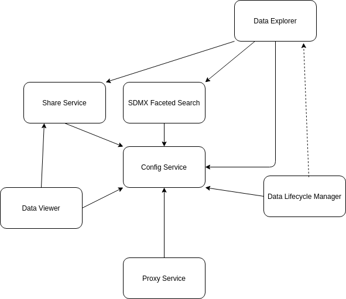

# Purpose

 The purpose of this document is to provide an overview of the solutions that make up the overall .Stat Suite, along with how the solutions fit together. It will focus heavily on information that would be useful for a developer or integration analyst setting up the .Stat Suite, and where possible will be technology-agnostic.

 The purpose of this is not a step-by-step set of instructions on installing and configuring the solution. Specific instructions are available in the [SIS-CC Documentation Pages](https://sis-cc.gitlab.io/dotstatsuite-documentation/) and in the individual solution repositories hosted [here](https://gitlab.com/sis-cc/.stat-suite). Rather, this document should provide an overview that makes following the individual instructions more meaningful and make debugging installation issues easier.

 # Some Background

 ## The .NET and JavaScript Split

 The .Stat Suite solutions can be divided into two groups:
 - The .NET Components, also known as the Core components, are all written in .NET Core, and generally consist of web APIs for managing and retrieving the contents of an SDMX [datasource](#datasources).
 - The JavaScript Components are all written in JavaScript (NodeJS and ReactJS) and generally have the purpose of supporting end-user interactions

 This split is not only important in terms of what infrastructure is required to run the groups, but because it is entirely possible to install the .NET Components without the JavaScript Components and vice versa (the exception to this is the [Data Lifecycle Manager](#data-lifecycle-manager), which expects to have .NET Components to call).

 Thus, we'll be splitting the descriptions of the .Stat Suite components along these lines.

 ## Datasources

The documentation around the JavaScript services often refers to datasources, and in fact it's one of the things you need to configure when you deploy them. Luckily, a datasource is pretty simple: it's a RESTful endpoint implementing the [SDMX REST API standard](https://github.com/sdmx-twg/sdmx-rest).

The .NET Components provide a datasource in the form of the [NSI Web Services](#nsi-services), so you have the option of deploying one or more sets of those as your datasource(s). However, a datasource could also be hosted by another organisation, and implemented in an entirely different framework.

## Extra Requirements

This will be described more in each individual solution's description, but in addition to implementing the SDMX REST API standard, a datasource must at this stage meet the following criteria:
- Be accessible from wherever users will be accessing the JavaScript frontends (generally this means from their personal computer and thus the open internet, but in enterprise situations there's likely to be firewall or proxy changes required)
- Be accessible from wherever the [SDMX Faceted Search](#sdmx-faceted-search) is hosted, and if using HTTPS, its certificate must be trusted by the SDMX Faceted Search application.
- Allow anonymous access (at this stage the [Data Explorer](#data-explorer) and [Data Viewer](#data-viewer) applications do not support non-anonymous requests)

 ## Tenants

 The concept of a *tenant* is something you'll need to keep in mind when deploying and configuring the JavaScript components. Conceptually tenants represent organisations or groups sharing instances of the JavaScript solutions, but using their own themes and configurations.

 From a deployment and configuration point of view though, a tenant is just a collection of configuration settings (not all settings can differ between tenants, and not all JavaScript solutions are tenant-aware {Nicolas-Review}). The key thing you'll need to consider when deploying and configuring the JavaScript components is the following question:

 ```
 Do I need multiple tenants (sets of configurations) or do I only need the one?
 ```

The answer to this question can fundamentally change how you perform the deployment. We'll get to that in specific services.

### Which Tenant is This Request For?

Tenant-enabled JavaScript components (currently [Data Explorer](#data-explorer), [Data Viewer](#data-viewer) and [Data Lifecycle Manager](#data-lifecycle-manager)) all expect to see something in each request that identifies which tenant the request pertains to. This is done by passing the tenant id (for example, 'oecd') in either the 'x-tenant' header, or in the 'tenant' query-string parameter. How this gets set, and what happens if it isn't, is described later in the deployment instructions.

# The JavaScript Components

As described previously, the JavaScript components are all geared towards the end-user experience, accessing or administering SDMX via a browser. The including applications are (in rough order of increasing dependency):
- [Config Service](#config-service)
- [Proxy Service](#proxy-service)
- [SDMX Faceted Search Service](#sdmx-faceted-search)
- [Share Service](#share-service)
- [Data Viewer](#data-viewer)
- [Data Explorer](#data-explorer)
- [Data Lifecycle Manager](#data-lifecycle-manager)

Although the [Data Lifecycle Manager](#data-lifecycle-manager) is listed here, it is so tightly-coupled to the .NET Components that we'll only discuss it after describing both sets of components.

The following diagram indicates the dependencies that the components have on one another. By saying a component is *dependent* on another, I mean that an instance of the former will not function correctly when deployed without an instance of the latter to refer to. In the diagram, a solid line indicates a direct connection is required. A broken line indicates that the dependencies is referential (the component doesn't need to be able to reach its dependency).



```
Note: As we'll find out later, the [Proxy Service](#proxy-service) is sort of dependent on all the other components, but it will always depend on the [Config Service](#config-service).
```

## Third-Party Dependencies

In addition to having dependencies on one another, the JavaScript components have dependencies on third-party products. These are:
- [Solr](#solr): The [SDMX Faceted Search Service](#sdmx-faceted-search) must be able to reach an appropriately configured instance of the [Apache Solr](https://lucene.apache.org/solr/) search platform
- [Redis](#redis): Both the [SDMX Faceted Search Service](#sdmx-faceted-search) and the [Share Service](#share-service) must be able to reach an appropriately configured instance (or instances... there's no obligation to share an instance) of the [Redis](https://redis.io/) in-memory database
- [Keycloak](#keycloak): In order to support authentication and authorization, the [Data Lifecycle Manager](#data-lifecycle-manager) expects there to exist an appropriately-configured [Keycloak](https://www.keycloak.org/) server. Note: connections to the Keycloak server are made through the browser, so DLM doesn't need a direct connection.

## Config Service

### Repository
[dotstatsuite-config](https://gitlab.com/sis-cc/.stat-suite/dotstatsuite-config)

### Depends On
The Config Service does not depend on any other JavaScript or third-party components.

### Depended On By
- [SDMX Faceted Search Service](#sdmx-faceted-search)
- [Share Service](#share-service)
- [Data Viewer](#data-viewer)
- [Data Explorer](#data-explorer)
- [Data Lifecycle Manager](#data-lifecycle-manager)

### Description

The Config Service provides all save one (the [Proxy Service](#proxy-service)) of the other JavaScript components with their configuration. It also serves up any tenant-specific assets (like images, css files, etc) that they need. At it's core, the Config Service is just a simple HTTP file server, serving configuration as JSON and other files as... other files.

Although the Config Service is how differences between [tenants](#tenants) are managed, it itself isn't actually **aware** of tenants, per se. The magic is managed by how the configuration files and asset files are organised on the server.

#### Configuration Files

The configuration files are stored in the *configs* folder in the deployed service. In this folder are two files, and some number of folders. The two files are the only two configuration files that do not vary based on tenant:
- [datasources.json](#datasources-file): This file describes all the [datasources](#datasources) available to the JavaScript components, as well as some extra information about them relevant largely to the [SDMX Faceted Search Service](#sdmx-faceted-search)
- [tenants.json](#tenants-file): This file lists all the available tenants, as well as potentially some information about how their authentication works

All the other configuration files are stored in subfolders classified by first which tenant they apply to, and then which application. From there, they're free to be organised however the application using them expects them to be.

Let's look an example. Let's say we want the settings file for Data Explorer, for the tenant with the id 'alakazam'. We would host it at 'configs/alakazam/data-explorer/settings.json'.


The above screenshot shows a configs folder with a number of tenants, supporting a number of applications.